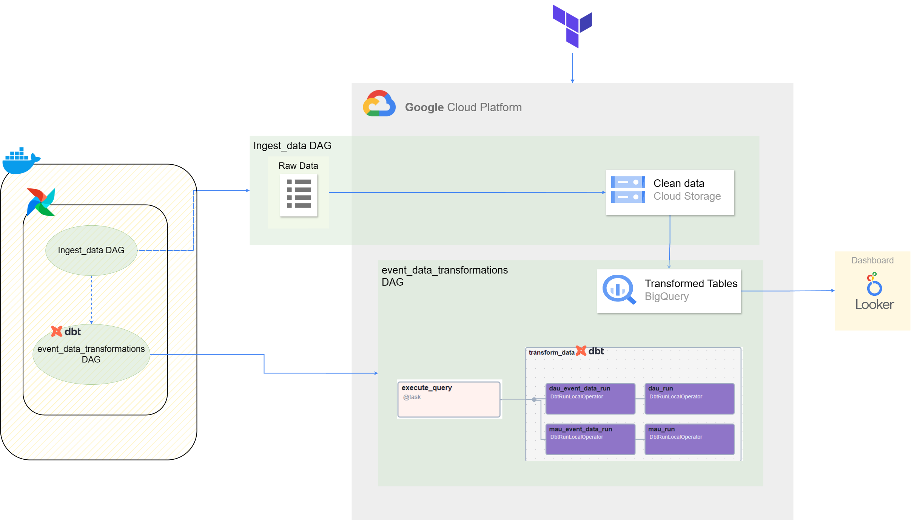

# AquaTech User Activity Analysis
## Introduction
In the realm of aquatic-focused startups, understanding user behavior and user growth are paramount. In pursuit of this understanding, AquaTech has embarked on an analysis of user activity on its platform. They want to analyze their user growth in terms of *daily active user (DAU)* and *monthly active user (MAU)*. Of course there are more rigorous criteria about *DAU* and *MAU*, but that's outside the scope of project, here we take a simple approach by counting distinct user based on *event time*.

Beside that, they want to know what kind of activities mostly user accessed in their platform. Data pertaining to user activity is collected and temporarily stored in the internal storage platform, residing on user devices. Subsequently, this data is pulled by a device every minute for all users. The pulled data is stored in JSON format with a timestamp naming convention, such as *20221130-111132.json*, signifying the data pull time as November 30, 2022, at 11:11:32 AM.

## Data Source Preparation
In this project, JSON files have been stored in the raw_data.zip file (located on Google Drive). To download the file, execute the bash script 
```
chmod +x download_raw_data.sh &&
./download_raw_data.sh
```
the output will be saved in the **./raw_data.zip** file.

Simply unzip the raw_data.zip file and save it to the ./airflow/data/ folder:
```
unzip ./raw_data.zip -d ./airflow/data/ &&
rm -f ./raw_data.zip
```
The output will be saved in the **./airflow/data/raw_data** folder with folder and file structures corresponding to the datetime format. 
Execute 
```
tree ./airflow/data/raw_data
``` 
command to view the folder structure.
Example folder/file Structure:
```
./airflow/data/raw_data
├── 2022-10-01
│  ├── 20221001-000000.json
│  ├── 20221001-000001.json
│  ├── 20221001-000010.json
│  ├── 20221001-000017.json
...
```

## Problem Statement
Below is an example JSON record from the raw data:
```
[{
  "distinct_id": "21920",
  "event": "$identify",
  "timestamp": "2022-10-01T14:44:35.546Z",
  "uuid": "01839401-d757-0001-295b-23cf4fc0a94a",
  "elements": [],
  "$geoip_city_name": "Palembang",
  "$geoip_country_name": "Indonesia",
  "$geoip_country_code": "ID",
  "$geoip_continent_name": "Asia",
  "$geoip_continent_code": "AS",
  "$geoip_latitude": -2.9146,
  "$geoip_longitude": 104.7535,
  "$geoip_time_zone": "Asia/Jakarta",
  "$geoip_subdivision_1_code": "SS",
  "$geoip_subdivision_1_name": "South Sumatra"
}]
```
The interesting thing here is that records with past *event times*(*timetamp*) may appear in the new JSON files (e.g., a JSON record with *"timestamp": "2022-09-22T11:09:43.929Z"* appears in the file *20221013-030129.json*). This is a kind of *"late arriving data"*. These delayed data will affect the daily active user (*dau*) and monthly active user (*mau*) tables. Therefore, _if there are late-arriving records, the *dau* for the related day (event_time) will be recalculated, as will the *mau* for the related month_.

To handle this case, we will add *dl_updated_at* column for each of our table indicating *data processing time* that we wil use as filter criteria to get new and late arriving data.

## Desired Output
#### Tables:
+	*event_data*: Contains parsed data from JSON files, with *timestamp* key in json is rename to *event_time* column.
+	*dau* (daily active user): Contains a summary of the number of active users in daily units (based on *event time*).
+	*mau* (monthly active user): Contains a summary of the number of active users in monthly units (based on *event time*).

#### Dashboard (Looker Studio - optional)

## Cloning the Repository
*Note: to follow along this tutorial, you need to use linux based OS or if you have windows OS, you can use Windows Subsystem for linux (WSL).*

To get started, clone this repository:
```
git clone https://github.com/maulanaady/AquaTech-User-Activity-Analysis.git &&
cd AquaTech-User-Activity-Analysis
```

## Data Tech Stacks
<details>
    <summary>Data Pipelines</summary>


</details>

We set up a batch data pipeline (using mixed cloud based and local based) to ingest, process and visualize the data.

+	[Google Cloud Platform (Cloud Storage and BigQuery)](https://console.cloud.google.com/)
+	[Terraform](https://developer.hashicorp.com/terraform/docs)
+	[Docker](https://docs.docker.com/)
+	[Airflow](https://airflow.apache.org/docs/)
+	[DBT (Data Build Tool)](https://docs.getdbt.com/)
+	Looker Studio (optional)

### Google Cloud Preparation
+	Create a GCP account.
+ Create a new project via: https://console.cloud.google.com/projectcreate
+	Create a [service account](https://console.cloud.google.com/iam-admin/serviceaccounts) in your Google Cloud project (IAM & Admin -> Service Accounts -> Create a Service Account) with roles:

    - Cloud Storage -> Storage Admin
    - BigQuery -> BigQuery Admin
    - Compute Engine -> Compute Admin

+	Download the service account JSON file (Service Account -> Actions -> Manage Keys -> Create a New Key -> JSON). Save this json file as *service-account.json* in the **gcp_terraform** folder.

### Terraform (for activating Cloud Storage and BigQuery services)
+	Install Terraform on your machine/VM.
+	Change directory to the **gcp_terraform** folder.
+	In the *gcp_terraform/variables.tf* file, update the Terraform variables for project, region, and location according to your preferences.
+	Execute following command to create the Cloud Storage bucket and BigQuery dataset.
  ```
  terraform init
  terraform plan
  terraform apply
  ```
+	Open google cloud console, and navigate to bigquery. Execute the query for the SQL commands in the *./ddl_table.sql* file.

### DBT
+	Update sources.database in the **./airflow/data/dbt/user_activity/models/staging/schema.yml** file according to your project Id.
+	We will use the *materialize = incremental* configuration for the *dau* and *mau* tables to handle *"late arriving data"*.

### Airflow
+ Preparation
  - Airflow will be deployed using Docker (specifically docker compose), so make sure Docker (and docker compose plugin) is installed on your machine/VM.
  - Copy the google cloud service-account.json file to the **./airflow/data** folder (to be used in creating a Google Cloud connection in Airflow).
  - Navigate to the **./airflow directory** and execute 
    ```
    chmod ugo+w data &&
    mkdir -p logs &&
    mkdir -p config &&
    mkdir -p plugins &&
    docker compose up -d
    ```
  - Ensure all services are up and running (`docker ps`).
  - Log in to the Airflow web server UI (http://localhost:8080) with the *username:airflow* and *password: airflow*. Hover over the admin tab and click connections.
  - Create a new connection with **Connection Type = Google Cloud** and **Connection Id = *‘google_client’***. Fill in the **Project Id** according to your project Id, and fill in the **Keyfile Path** referring to service-account.json **(/opt/airflow/data/service-account.json)**.
  - Click the test button at the bottom to test the connection to Google Cloud with the predefined configuration. A successful connection test will display *"Connection successfully tested"* at the top of the web page (scroll up), and then save the connection.

+ DAGs

  In this project, we run two DAGs: *get_data* and *event_data_transformations*.

  - DAG *get_data*:
    This DAG runs every hour (schedule = hourly) and retrieves and processes raw data JSON files according to the execution time parameter in Airflow (not all JSON files are processed at once). The output of one run of the DAG is a CSV file uploaded to Cloud Storage with the naming format: *output_{data_interval_start}_{data_interval_end}.csv (e.g., output_20240413030000_20240413040000.csv is the file generated when the DAG runs for the schedule interval from April 13, 2024, at 03:00:00 to April 13, 2024, at 04:00:00)*. Therefore, in one day, 24 files will be generated. 
    When the *data_interval_start* is at 00:00 early in the morning, this DAG will trigger the *event_data_transformations* DAG for execution. 

    Activate the DAG by clicking on the DAGs tab on the web and unpausing the get_data DAG, then the job to extract data from the JSON file will run and store the results in Cloud Storage.

  - DAG *event_data_transformations*:
  
    Edit value for *project* key at *profile_args* dict in *ProfileConfig* configration to your preferences project id.

    Unpause the *event_data_transformations* DAG. This DAG runs using the data aware scheduling (dataset schedule) triggered by the *get_data* DAG. When running, this DAG will execute a BigQuery query to create an external table from the CSV file in Cloud Storage for a one-day range and then insert it into the *event_data* table. Next, Airflow will execute the DBT command to transform *event_data* table to upsert the *dau* and *mau* tables.

### Looker Studio (optional)
Create dashboard using your prefered tools. Here we create visualizations using Looker Studio with the *event_data*, *dau*, and *mau* tables. Below is example of the dashboard.


